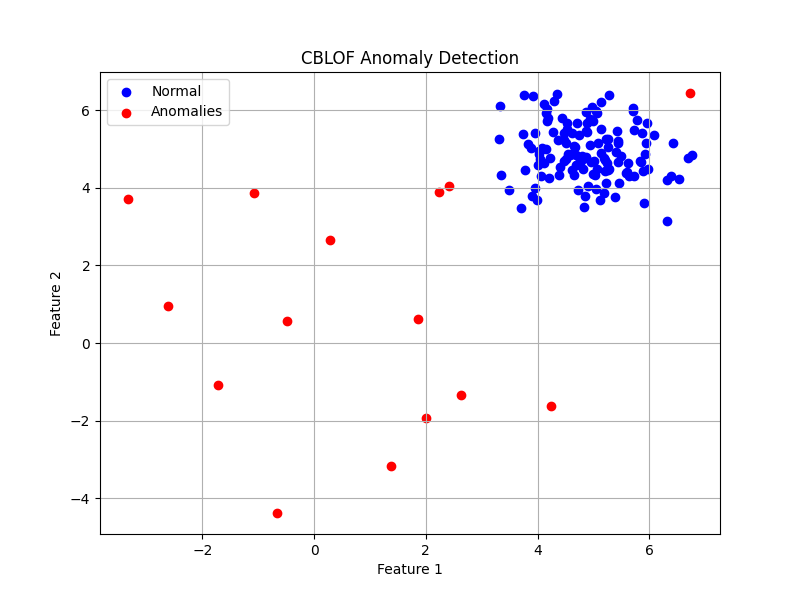

The **CBLOF** model (Clustering-Based Local Outlier Factor) is a clustering-based anomaly detection method. It is specifically designed to identify data points that do not belong to any cluster or are far from the cluster centers. CBLOF is well-suited for detecting anomalies in datasets that contain a mix of large and small clusters.
### Visualize the results sample (CBLOF_PyOD)

### How the CBLOF Model Works:
1. **Clustering the Data**: First, it clusters the data using a clustering algorithm (such as KMeans).
2. **Dividing Clusters into Large and Small**: The clusters are divided into two groups: large clusters and small clusters. This division is based on the number of data points in each cluster.
3. **Anomaly Detection**:
   - Data points in small clusters are considered potential anomalies.
   - For data points in large clusters, their distance from the cluster center is calculated. The farther away a point is from the center, the more likely it is an anomaly.
4. **Calculating Anomaly Scores**: An anomaly score is assigned to each point based on its distance from the cluster center and the size of the cluster. Points with higher scores are considered more anomalous.

### Important CBLOF Parameters:
- **`n_clusters`**: The number of clusters to divide the data into.
- **`contamination`**: The proportion of outliers in the data. This helps the model estimate how many data points might be anomalous.
- **`alpha`**: A factor used to determine large and small clusters. Clusters smaller than this proportion of the largest cluster are classified as small clusters.
- **`beta`**: A threshold to define what constitutes a large cluster.

### Advantages and Disadvantages of CBLOF:
#### Advantages:
- It performs well on datasets containing both small and large clusters.
- It can detect anomalies that are far from the centers of large clusters.

#### Disadvantages:
- It is sensitive to the number of clusters and the clustering parameters.
- It may not work well on datasets that are not naturally clustered.

### Applications:
CBLOF is widely used in areas such as:
- **Fraud detection in financial data**: Identifying unusual transactions among regular ones.
- **Network analysis**: Detecting abnormal activities in communication networks.
- **Monitoring systems**: Identifying failures or abnormal behavior in industrial systems.

