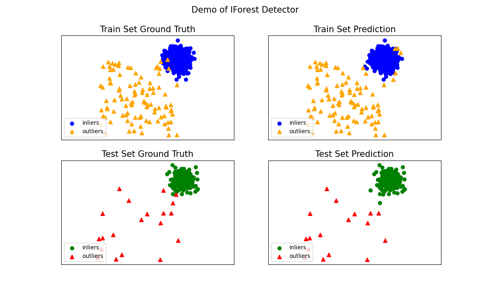

The Density-based Isolation Forest (DIF) is one of the anomaly detection algorithms provided in PyOD, a popular library for outlier detection in Python. Here's a sample code for using DIF with PyOD:

```python
# Import necessary libraries
from pyod.models.iforest import IForest
from pyod.utils.data import generate_data
from pyod.utils.data import evaluate_print
from pyod.utils.example import visualize

# Generate a sample dataset
X_train, X_test, y_train, y_test = generate_data(
    n_train=1000, n_test=200, n_features=2, contamination=0.1, random_state=22)

# Initialize the Density-based Isolation Forest (DIF) detector
clf = IForest(contamination=contamination, behaviour="new", random_state=42)

# Fit the model on training data
clf.fit(X_train)

# Get the prediction labels and outlier scores
y_train_pred = clf.labels_  # Predictions on the training data
y_train_scores = clf.decision_scores_  # Outlier scores on the training data
y_test_pred = clf.predict(X_test)  # Predictions on the test data
y_test_scores = clf.decision_function(X_test)  # Outlier scores on the test data

# Evaluate the model
print("\nOn Training Data:")
evaluate_print("IForest", y_train, y_train_scores)

print("\nOn Test Data:")
evaluate_print("IForest", y_test, y_test_scores)

# Visualize the results (only works for 2D data)
visualize("IForest", X_train, y_train, X_test, y_test, y_train_pred, y_test_pred)
```

### Explanation:
1. **Generate Data**: Creates a synthetic dataset with a specified contamination rate.
2. **Initialize and Train DIF**: We set `contamination` to control the percentage of outliers.
3. **Prediction and Evaluation**: The labels and scores for the training and test data are obtained.
4. **Visualization**: Shows detected outliers in a 2D plot if applicable.

### Notes:
- Replace `behaviour="new"` with your preferred setting. `"new"` is compatible with recent versions.
