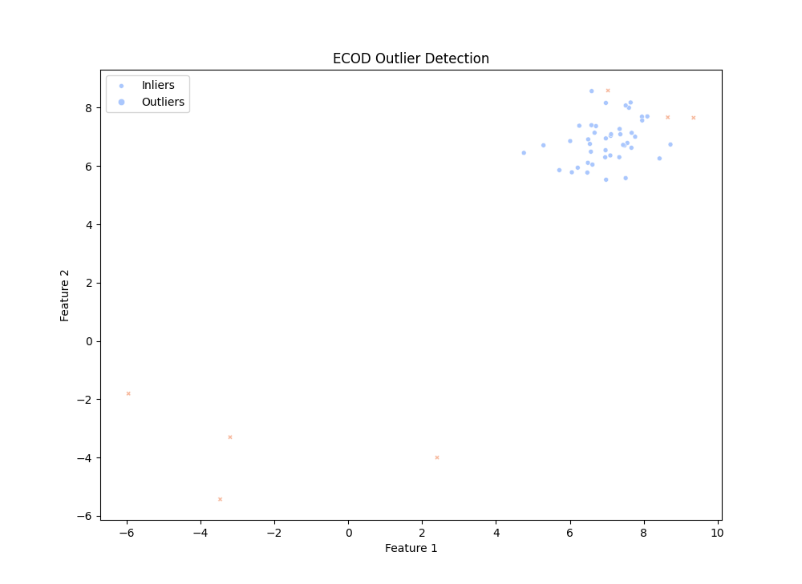

Here’s a sample code using **ECOD (Empirical Cumulative Distribution Functions)** from the PyOD library. ECOD is an unsupervised outlier detection method based on empirical cumulative distribution functions.

First, install the PyOD library if you haven't already:

```bash
pip install pyod
```

Here is a basic example using the **ECOD** model:

```python
# Import necessary libraries
from pyod.models.ecod import ECOD
import numpy as np
from pyod.utils.data import generate_data
from sklearn.model_selection import train_test_split


# Generate synthetic data with outliers
# n_train: number of training points
# n_test: number of testing points
# n_features: number of features (dimensions)
# contamination: percentage of outliers (anomalies) in the data
X_train, X_test, y_train, y_test = generate_data(n_train=200, n_test=100, n_features=2, contamination=0.1)


# Split the data into train and test sets
X_train, X_test = train_test_split(X, test_size=0.2, random_state=42)

# Initialize the ECOD model
model = ECOD()

# Fit the model on the training data
model.fit(X_train)

# Predict the anomaly scores for the test data
anomaly_scores = model.decision_function(X_test)

# Classify data as inliers (0) or outliers (1)
predictions = model.predict(X_test)

# Print results
print("Anomaly Scores:", anomaly_scores)
print("Predictions (0: inlier, 1: outlier):", predictions)
```
### Visualize the results sample (ECOD_PyOD)


### Explanation:
1. **Data Generation**: The data includes normal data and outliers (a few points far from the mean).
2. **Model Training**: The `ECOD` model is trained on the data.
3. **Anomaly Detection**: Anomaly scores and outlier predictions are calculated.

