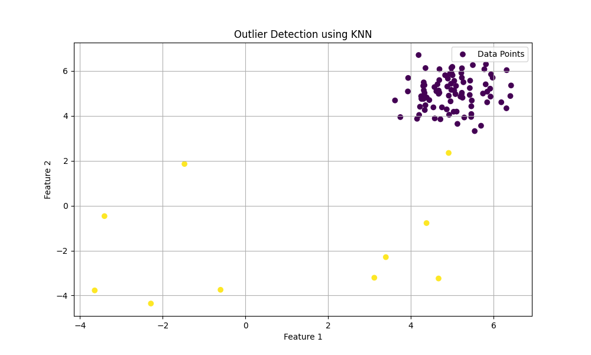

PyOD (Python Outlier Detection) is a comprehensive library designed for detecting outliers in multivariate data. Below is a simple example demonstrating how to use PyOD for outlier detection using the k-Nearest Neighbors (KNN) algorithm. 
### Visualize the results sample (KNN_PyOD.py)

### Explanation
1. **Import Libraries**: The code imports necessary libraries, including NumPy for numerical operations, Matplotlib for plotting, and PyOD for outlier detection.
   
2. **Generate Synthetic Data**: `generate_data` is used to create synthetic training and testing datasets with specified parameters. In this case, 10% of the data points are set as outliers.

3. **Initialize the KNN Model**: An instance of the KNN outlier detection model is created.

4. **Fit the Model**: The model is trained using the training dataset.

5. **Predict Outliers**: The model predicts whether each point in the test set is an outlier or not.

6. **Visualize Results**: Finally, it visualizes the test dataset, coloring the points based on whether they are detected as outliers.

### Installation
To use PyOD, you need to install it first. You can do this using pip:

```bash
pip install pyod
```

### Note
Feel free to adjust parameters such as the number of features, the fraction of outliers, or switch to different models available in PyOD, such as Isolation Forest or AutoEncoder, based on your needs.